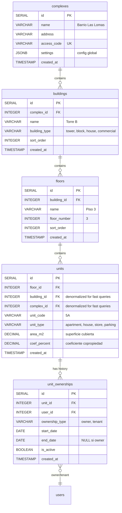
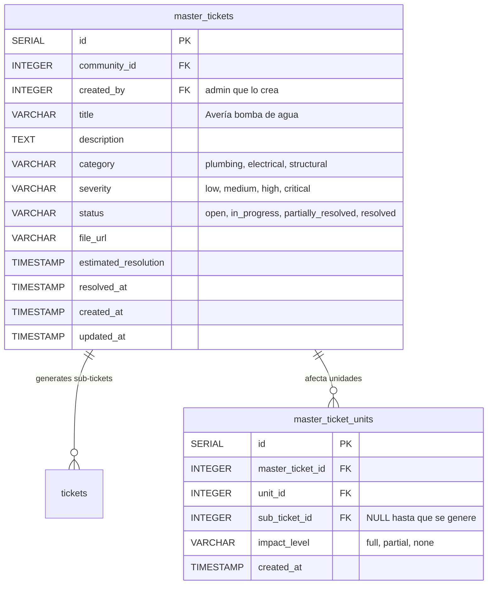
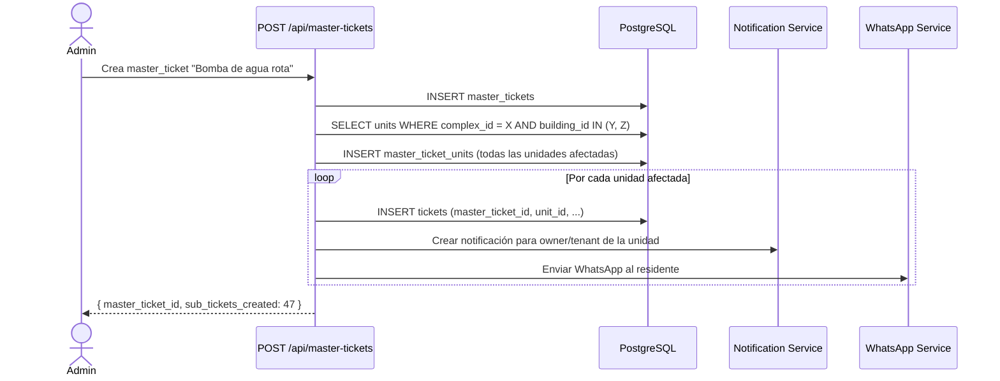
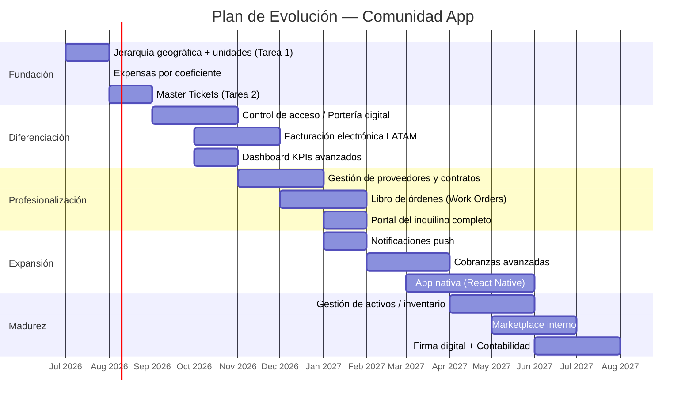
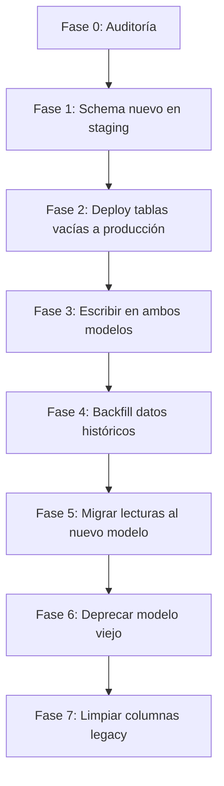
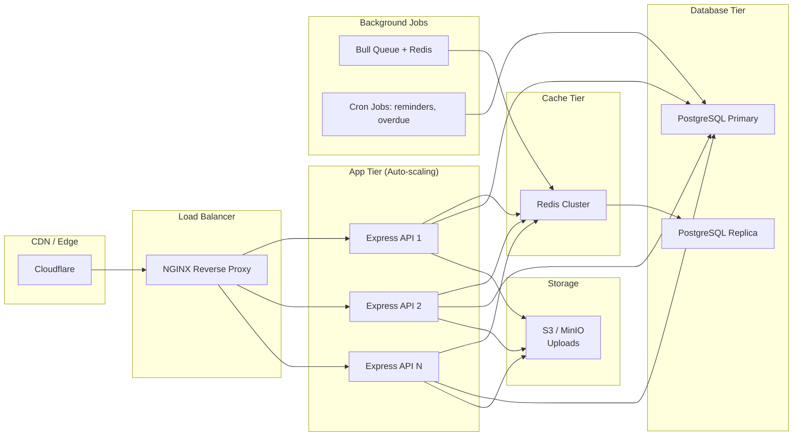

# PROFESSIONAL ROADMAP — Arquitectura de Escalabilidad y Dominio

> **Autor:** Senior Software Architect | PropTech LATAM  
> **Proyecto:** Comunidad App  
> **Fecha:** Julio 2026  
> **Versión:** 1.0

---

## Tabla de Contenidos

1. [Tarea 1: Análisis Estructural y Modelado de Datos](#tarea-1-análisis-estructural-y-modelado-de-datos)
2. [Tarea 2: Tickets Maestros y Jerarquía de Incidencias](#tarea-2-tickets-maestros-y-jerarquía-de-incidencias)
3. [Tarea 3: Benchmarking y Funcionalidades Faltantes](#tarea-3-benchmarking-y-funcionalidades-faltantes)
4. [Tarea 4: Plan de Escalamiento Técnico](#tarea-4-plan-de-escalamiento-técnico)

---

## Tarea 1: Análisis Estructural y Modelado de Datos

### 1.1 Limitaciones críticas del modelo actual (`unit_number` como string)

Tras analizar el código en `src/backend/models/`, `src/backend/migrations/` y `src/backend/controllers/`, se identifican las siguientes limitaciones:

#### A. Ausencia de integridad referencial geográfica

Actualmente `unit_number` es un `VARCHAR(20)` libre que aparece en **6 tablas** sin FK a ninguna entidad de localización:

| Tabla | Columna | Referencia actual |
|-------|---------|-------------------|
| `users` | `unit_number` | Ninguna |
| `unit_expenses` | `unit_number` | UNIQUE(expense_id, unit_number) |
| `tickets` | `unit_number` | Ninguna |
| `bookings` | `unit_number` | Ninguna |
| `invites` | `unit_number` | Ninguna |
| `reports` (queries) | `ue.unit_number` | String matching |

Esto significa que "Torre B, Piso 3, Depto 5A", "TorreB-P3-D5A", "B-3-5A" y "B 3 5A" son 4 unidades distintas para el sistema. No hay forma de validar que una unidad realmente existe.

#### B. Imposibilidad de consultas jerárquicas

Para responder _"¿Cuánto se recaudó en la Torre B este mes?"_ o _"¿Cuáles son los departamentos morosos del Piso 3?"_, el sistema actual necesita `LIKE '%Torre B%'` o `SUBSTRING` sobre el campo `unit_number`, lo cual:

- No usa índices (full table scan)
- Es frágil ante inconsistencias de formato
- No escala con 10,000+ unidades

#### C. Imposibilidad de representar ownership/tenancy

El modelo actual asigna `user` → `unit_number` directo, sin track de:
- Fecha de inicio/fin de contrato de alquiler
- Historial de propietarios de una unidad
- Múltiples inquilinos por unidad a lo largo del tiempo
- Unidades desocupadas sin usuario asignado

#### D. Booking y tickets sin validación espacial

Al crear un `booking` para un `amenity`, se guarda el `unit_number` como string. Si un residente se muda de la unidad 5A a la 6B, sus bookings pasados quedan referenciando una unidad "vieja" sin trazabilidad.

#### E. Imposibilidad de expensas por metro cuadrado o coeficiente

En edificios LATAM es estándar que las expensas se prorrateen por:
- **Superficie cubierta** (m²)
- **Coeficiente de copropiedad** (%)
- **Tipo de unidad** (departamento vs local comercial vs cochera)

El modelo actual divide `fixed_amount / count(units)` sin ponderación (ver `expenseController.create`). Esto es inviable para un edificio con departamentos de 40 m² y 120 m² en la misma torre.

#### F. Sin soporte para "sub-comunidades"

Un Barrio Cerrado puede tener gastos comunes generales (seguridad perimetral, calles internas) y gastos específicos por manzana (ascensor de la Torre 3). El modelo actual no permite segmentar expensas por sub-agrupación.

---

### 1.2 Nuevo modelo de datos normalizado

#### Diagrama Entidad-Relación (Mermaid)



#### Tabla `complexes`

```sql
CREATE TABLE IF NOT EXISTS complexes (
    id              SERIAL PRIMARY KEY,
    name            VARCHAR(255) NOT NULL,
    address         VARCHAR(255),
    access_code     VARCHAR(50) UNIQUE NOT NULL,
    settings        JSONB DEFAULT '{}',
    created_at      TIMESTAMP DEFAULT NOW()
);
```

#### Tabla `buildings`

```sql
CREATE TABLE IF NOT EXISTS buildings (
    id              SERIAL PRIMARY KEY,
    complex_id      INTEGER NOT NULL REFERENCES complexes(id) ON DELETE CASCADE,
    name            VARCHAR(100) NOT NULL,
    building_type   VARCHAR(20) DEFAULT 'tower'
                    CHECK (building_type IN ('tower', 'block', 'house', 'commercial', 'amenity')),
    sort_order      INTEGER DEFAULT 0,
    created_at      TIMESTAMP DEFAULT NOW()
);
```

#### Tabla `floors`

```sql
CREATE TABLE IF NOT EXISTS floors (
    id              SERIAL PRIMARY KEY,
    building_id     INTEGER NOT NULL REFERENCES buildings(id) ON DELETE CASCADE,
    name            VARCHAR(50) NOT NULL,
    floor_number    INTEGER NOT NULL,
    sort_order      INTEGER DEFAULT 0,
    created_at      TIMESTAMP DEFAULT NOW(),
    UNIQUE(building_id, floor_number)
);
```

#### Tabla `units` (entidad central de la jerarquía)

```sql
CREATE TABLE IF NOT EXISTS units (
    id              SERIAL PRIMARY KEY,
    floor_id        INTEGER NOT NULL REFERENCES floors(id) ON DELETE CASCADE,
    building_id     INTEGER NOT NULL REFERENCES buildings(id) ON DELETE CASCADE,
    complex_id      INTEGER NOT NULL REFERENCES complexes(id) ON DELETE CASCADE,
    unit_code       VARCHAR(20) NOT NULL,
    unit_type       VARCHAR(20) DEFAULT 'apartment'
                    CHECK (unit_type IN ('apartment', 'house', 'store', 'parking', 'storage', 'office')),
    area_m2         DECIMAL(8,2),
    coef_percent    DECIMAL(5,4),  -- ej. 0.0525 = 5.25% del total
    is_active       BOOLEAN DEFAULT TRUE,
    created_at      TIMESTAMP DEFAULT NOW(),
    UNIQUE(floor_id, unit_code)
);
```

#### Tabla `unit_ownerships` (historial de ocupación)

```sql
CREATE TABLE IF NOT EXISTS unit_ownerships (
    id              SERIAL PRIMARY KEY,
    unit_id         INTEGER NOT NULL REFERENCES units(id) ON DELETE CASCADE,
    user_id         INTEGER NOT NULL REFERENCES users(id) ON DELETE CASCADE,
    ownership_type  VARCHAR(10) NOT NULL DEFAULT 'owner'
                    CHECK (ownership_type IN ('owner', 'tenant')),
    start_date      DATE NOT NULL DEFAULT CURRENT_DATE,
    end_date        DATE,
    is_active       BOOLEAN DEFAULT TRUE,
    created_at      TIMESTAMP DEFAULT NOW()
);

CREATE INDEX idx_uo_unit_active ON unit_ownerships(unit_id) WHERE is_active = TRUE;
CREATE INDEX idx_uo_user_active ON unit_ownerships(user_id) WHERE is_active = TRUE;
```

---

### 1.3 Script SQL completo — Migración 013

Archivo: `src/backend/migrations/013_hierarchy.sql`

```sql
-- ============================================================
-- MIGRACIÓN 013: Jerarquía Complejo > Edificio > Piso > Unidad
-- Reemplaza el modelado plano unit_number (VARCHAR)
-- por un grafo geográfico normalizado con integridad referencial.
-- ============================================================

BEGIN;

-- -------------------------------------------------------
-- 1. CREACIÓN DE TABLAS DE JERARQUÍA
-- -------------------------------------------------------

CREATE TABLE IF NOT EXISTS complexes (
    id              SERIAL PRIMARY KEY,
    name            VARCHAR(255) NOT NULL,
    address         VARCHAR(255),
    access_code     VARCHAR(50) UNIQUE NOT NULL,
    settings        JSONB DEFAULT '{}',
    created_at      TIMESTAMP DEFAULT NOW()
);

CREATE TABLE IF NOT EXISTS buildings (
    id              SERIAL PRIMARY KEY,
    complex_id      INTEGER NOT NULL REFERENCES complexes(id) ON DELETE CASCADE,
    name            VARCHAR(100) NOT NULL,
    building_type   VARCHAR(20) DEFAULT 'tower'
                    CHECK (building_type IN ('tower', 'block', 'house', 'commercial', 'amenity')),
    sort_order      INTEGER DEFAULT 0,
    created_at      TIMESTAMP DEFAULT NOW()
);

CREATE TABLE IF NOT EXISTS floors (
    id              SERIAL PRIMARY KEY,
    building_id     INTEGER NOT NULL REFERENCES buildings(id) ON DELETE CASCADE,
    name            VARCHAR(50) NOT NULL,
    floor_number    INTEGER NOT NULL,
    sort_order      INTEGER DEFAULT 0,
    created_at      TIMESTAMP DEFAULT NOW(),
    UNIQUE(building_id, floor_number)
);

CREATE TABLE IF NOT EXISTS units (
    id              SERIAL PRIMARY KEY,
    floor_id        INTEGER NOT NULL REFERENCES floors(id) ON DELETE CASCADE,
    building_id     INTEGER NOT NULL REFERENCES buildings(id) ON DELETE CASCADE,
    complex_id      INTEGER NOT NULL REFERENCES complexes(id) ON DELETE CASCADE,
    unit_code       VARCHAR(20) NOT NULL,
    unit_type       VARCHAR(20) DEFAULT 'apartment'
                    CHECK (unit_type IN ('apartment', 'house', 'store', 'parking', 'storage', 'office')),
    area_m2         DECIMAL(8,2),
    coef_percent    DECIMAL(5,4),
    is_active       BOOLEAN DEFAULT TRUE,
    created_at      TIMESTAMP DEFAULT NOW(),
    UNIQUE(floor_id, unit_code)
);

CREATE TABLE IF NOT EXISTS unit_ownerships (
    id              SERIAL PRIMARY KEY,
    unit_id         INTEGER NOT NULL REFERENCES units(id) ON DELETE CASCADE,
    user_id         INTEGER NOT NULL REFERENCES users(id) ON DELETE CASCADE,
    ownership_type  VARCHAR(10) NOT NULL DEFAULT 'owner'
                    CHECK (ownership_type IN ('owner', 'tenant')),
    start_date      DATE NOT NULL DEFAULT CURRENT_DATE,
    end_date        DATE,
    is_active       BOOLEAN DEFAULT TRUE,
    created_at      TIMESTAMP DEFAULT NOW()
);

-- -------------------------------------------------------
-- 2. ÍNDICES PARA RENDIMIENTO
-- -------------------------------------------------------

-- Búsquedas por jerarquía
CREATE INDEX idx_buildings_complex    ON buildings(complex_id);
CREATE INDEX idx_floors_building      ON floors(building_id);
CREATE INDEX idx_units_floor          ON units(floor_id);
CREATE INDEX idx_units_building       ON units(building_id);
CREATE INDEX idx_units_complex        ON units(complex_id);

-- Búsqueda compuesta: las queries típicas son "dame todas las unidades del complejo X, edificio Y"
CREATE INDEX idx_units_complex_building ON units(complex_id, building_id);

-- Ownership
CREATE INDEX idx_uo_unit_active       ON unit_ownerships(unit_id) WHERE is_active = TRUE;
CREATE INDEX idx_uo_user_active       ON unit_ownerships(user_id) WHERE is_active = TRUE;
CREATE INDEX idx_uo_user_unit         ON unit_ownerships(user_id, unit_id);

-- Ordenamiento
CREATE INDEX idx_buildings_sort       ON buildings(complex_id, sort_order);
CREATE INDEX idx_floors_sort          ON floors(building_id, sort_order);

-- -------------------------------------------------------
-- 3. MIGRACIÓN DE DATOS EXISTENTES
--    Asume: 1 comunidad = 1 complejo = 1 edificio = 1 piso
--    Todas las unidades van temporalmente a una jerarquía plana.
-- -------------------------------------------------------

-- Paso 3a: Insertar complex por cada community existente
INSERT INTO complexes (name, address, access_code, created_at)
SELECT
    name,
    address,
    access_code,
    created_at
FROM communities
ON CONFLICT (access_code) DO NOTHING;

-- Paso 3b: Insertar un edificio por defecto para cada complex
INSERT INTO buildings (complex_id, name, building_type, sort_order, created_at)
SELECT
    cpx.id,
    'Edificio Principal',
    'tower',
    0,
    NOW()
FROM complexes cpx
WHERE NOT EXISTS (
    SELECT 1 FROM buildings b WHERE b.complex_id = cpx.id
);

-- Paso 3c: Insertar un piso por defecto para cada edificio
INSERT INTO floors (building_id, name, floor_number, sort_order, created_at)
SELECT
    b.id,
    'Piso 1',
    1,
    0,
    NOW()
FROM buildings b
WHERE NOT EXISTS (
    SELECT 1 FROM floors f WHERE f.building_id = b.id
);

-- Paso 3d: Insertar unidades desde los unit_number existentes en users
-- NOTA: Agrupamos por (community_id, unit_number) DISTINCT
INSERT INTO units (floor_id, building_id, complex_id, unit_code, unit_type, area_m2, coef_percent, created_at)
SELECT DISTINCT
    f.id AS floor_id,
    b.id AS building_id,
    cpx.id AS complex_id,
    TRIM(u.unit_number) AS unit_code,
    'apartment' AS unit_type,
    NULL AS area_m2,
    NULL AS coef_percent,
    NOW() AS created_at
FROM users u
JOIN communities comm ON comm.id = u.community_id
JOIN complexes cpx ON cpx.access_code = comm.access_code
JOIN buildings b ON b.complex_id = cpx.id
JOIN floors f ON f.building_id = b.id
WHERE u.unit_number IS NOT NULL
  AND TRIM(u.unit_number) <> ''
  AND NOT EXISTS (
      SELECT 1 FROM units un
      WHERE un.complex_id = cpx.id
        AND un.unit_code = TRIM(u.unit_number)
  );

-- Paso 3e: Crear ownerships para todos los usuarios activos
INSERT INTO unit_ownerships (unit_id, user_id, ownership_type, start_date, is_active)
SELECT
    un.id AS unit_id,
    u.id  AS user_id,
    CASE WHEN u.user_type = 'tenant' THEN 'tenant' ELSE 'owner' END,
    CURRENT_DATE,
    TRUE
FROM users u
JOIN complexes cpx ON cpx.access_code = (
    SELECT comm.access_code FROM communities comm WHERE comm.id = u.community_id
)
JOIN buildings b ON b.complex_id = cpx.id
JOIN floors f ON f.building_id = b.id
JOIN units un ON un.floor_id = f.id
              AND un.unit_code = TRIM(u.unit_number)
WHERE u.unit_number IS NOT NULL
  AND TRIM(u.unit_number) <> ''
  AND NOT EXISTS (
      SELECT 1 FROM unit_ownerships uo
      WHERE uo.user_id = u.id AND uo.unit_id = un.id
  );

-- -------------------------------------------------------
-- 4. NUEVAS COLUMNAS EN TABLAS EXISTENTES (soft FK)
--    Mantenemos compatibilidad hacia atrás con unit_number string
--    mientras migramos gradualmente a unit_id.
-- -------------------------------------------------------

-- Agregar unit_id a users (FK opcional, se llena en la migración)
ALTER TABLE users ADD COLUMN IF NOT EXISTS unit_id INTEGER REFERENCES units(id) ON DELETE SET NULL;

-- Actualizar users.unit_id desde la tabla unit_ownerships
UPDATE users u SET unit_id = uo.unit_id
FROM unit_ownerships uo
WHERE uo.user_id = u.id AND uo.is_active = TRUE;

-- Agregar unit_id a unit_expenses
ALTER TABLE unit_expenses ADD COLUMN IF NOT EXISTS unit_id INTEGER REFERENCES units(id) ON DELETE CASCADE;

UPDATE unit_expenses ue SET unit_id = un.id
FROM expenses e
JOIN communities comm ON comm.id = e.community_id
JOIN complexes cpx ON cpx.access_code = comm.access_code
JOIN buildings b ON b.complex_id = cpx.id
JOIN floors f ON f.building_id = b.id
JOIN units un ON un.floor_id = f.id AND un.unit_code = TRIM(ue.unit_number)
WHERE ue.expense_id = e.id;

-- Agregar unit_id a tickets
ALTER TABLE tickets ADD COLUMN IF NOT EXISTS unit_id INTEGER REFERENCES units(id) ON DELETE SET NULL;

UPDATE tickets t SET unit_id = un.id
FROM communities comm
JOIN complexes cpx ON cpx.access_code = comm.access_code
JOIN buildings b ON b.complex_id = cpx.id
JOIN floors f ON f.building_id = b.id
JOIN units un ON un.floor_id = f.id AND un.unit_code = TRIM(t.unit_number)
WHERE t.community_id = comm.id;

-- Agregar unit_id a bookings
ALTER TABLE bookings ADD COLUMN IF NOT EXISTS unit_id INTEGER REFERENCES units(id) ON DELETE SET NULL;

UPDATE bookings bk SET unit_id = un.id
FROM amenities a
JOIN communities comm ON comm.id = a.community_id
JOIN complexes cpx ON cpx.access_code = comm.access_code
JOIN buildings b ON b.complex_id = cpx.id
JOIN floors f ON f.building_id = b.id
JOIN units un ON un.floor_id = f.id AND un.unit_code = TRIM(bk.unit_number)
WHERE bk.amenity_id = a.id;

-- Agregar unit_id a invites
ALTER TABLE invites ADD COLUMN IF NOT EXISTS unit_id INTEGER REFERENCES units(id) ON DELETE SET NULL;

-- -------------------------------------------------------
-- 5. VERIFICACIÓN DE INTEGRIDAD
-- -------------------------------------------------------

-- Verifica que no haya unit_expenses sin unit_id (serán NULL si el unit_number no matcheó)
DO $$
DECLARE
    orphan_count INTEGER;
BEGIN
    SELECT COUNT(*) INTO orphan_count FROM unit_expenses WHERE unit_id IS NULL;
    IF orphan_count > 0 THEN
        RAISE WARNING 'Hay % unit_expenses sin unit_id. Revisar unit_numbers inconsistentes.', orphan_count;
    END IF;

    SELECT COUNT(*) INTO orphan_count FROM tickets WHERE unit_id IS NULL;
    IF orphan_count > 0 THEN
        RAISE WARNING 'Hay % tickets sin unit_id. Revisar unit_numbers inconsistentes.', orphan_count;
    END IF;
END $$;

COMMIT;
```

---

### 1.4 Impacto en endpoints y tablas existentes

#### A. `expenses` — Nueva forma de prorrateo

En `expenseController.create` (línea ~25), actualmente divide `fixed_amount / total_units` por igual. Con la jerarquía, debe usar `coef_percent`:

```js
// Antes: división equitativa
const amountPerUnit = fixed_amount / units.length;

// Después: prorrateo por coeficiente
const unitRecords = await pool.query(
    `SELECT id, unit_code, coef_percent, area_m2
     FROM units
     WHERE complex_id = $1 AND is_active = TRUE`, [complexId]
);
for (const u of unitRecords.rows) {
    const amount = u.coef_percent
        ? parseFloat(fixed_amount) * parseFloat(u.coef_percent)
        : parseFloat(fixed_amount) / unitRecords.rows.length;
    // INSERT INTO unit_expenses (expense_id, unit_id, amount_owed, ...)
}
```

#### B. `GET /expenses/my` — Cambia JOIN

```sql
-- Antes
SELECT ue.*, e.description, e.due_date
FROM unit_expenses ue
JOIN expenses e ON e.id = ue.expense_id
WHERE ue.unit_number = $1 AND e.community_id = $2

-- Después
SELECT ue.*, e.description, e.due_date,
       un.unit_code, f.name AS floor_name, b.name AS building_name
FROM unit_expenses ue
JOIN expenses e ON e.id = ue.expense_id
JOIN units un ON un.id = ue.unit_id
JOIN floors f ON f.id = un.floor_id
JOIN buildings b ON b.id = un.building_id
WHERE ue.unit_id = (
    SELECT uo.unit_id FROM unit_ownerships uo
    WHERE uo.user_id = $1 AND uo.is_active = TRUE
    LIMIT 1
)
```

#### C. `GET /dashboard/admin` — Agregaciones por edificio

El dashboard admin (`Dashboard.admin` en `models/Dashboard.js:18`) debe extenderse con:

```sql
-- Nueva métrica: morosidad por edificio
SELECT
    b.name AS building,
    COUNT(ue.id) AS total_units,
    COUNT(ue.id) FILTER (WHERE ue.status != 'paid') AS morosas,
    ROUND(
        COUNT(ue.id) FILTER (WHERE ue.status != 'paid')::DECIMAL
        / NULLIF(COUNT(ue.id), 0) * 100, 1
    ) AS pct_morosidad
FROM unit_expenses ue
JOIN expenses e ON e.id = ue.expense_id
JOIN units un ON un.id = ue.unit_id
JOIN buildings b ON b.id = un.building_id
WHERE e.community_id = $1
  AND e.due_date <= CURRENT_DATE
GROUP BY b.id, b.name
ORDER BY pct_morosidad DESC;
```

#### D. `GET /dashboard/residente` — Incluye metadatos de jerarquía

```js
// models/Dashboard.js — residente(userId)
// Agregar al SELECT:
//   un.unit_code, f.name AS floor_name, b.name AS building_name,
//   cpx.name AS complex_name
// Para que el front muestre "Barrio Las Lomas > Torre B > Piso 3 > Depto 5A"
```

#### E. Modificaciones requeridas en tablas existentes

| Tabla | Columna nueva | Tipo | Notas |
|-------|---------------|------|-------|
| `users` | `unit_id` | `INTEGER FK → units(id)` | Reemplaza gradualmente a `unit_number` |
| `unit_expenses` | `unit_id` | `INTEGER FK → units(id)` | Clave para JOINs jerárquicos |
| `tickets` | `unit_id` | `INTEGER FK → units(id)` | Idem |
| `bookings` | `unit_id` | `INTEGER FK → units(id)` | Idem |
| `invites` | `unit_id` | `INTEGER FK → units(id)` | Idem |

**Estrategia de transición:** Mantener `unit_number` como columna legacy (puede ser NULL) y poblarla automáticamente desde la jerarquía con un trigger, mientras todas las queries nuevas usan `unit_id`. Eliminar `unit_number` en una migración futura (v2.0).

---

## Tarea 2: Tickets Maestros y Jerarquía de Incidencias

### 2.1 Modelo de datos para Master Tickets

Un `master_ticket` representa una incidencia que afecta a múltiples unidades (ej. bomba de agua rota, corte de luz programado, caída de árbol común). Los `sub_tickets` son instancias individuales por unidad afectada.



#### Script SQL — Migración 014

Archivo: `src/backend/migrations/014_master_tickets.sql`

```sql
BEGIN;

-- Tabla de tickets maestros (incidencias generales)
CREATE TABLE IF NOT EXISTS master_tickets (
    id                  SERIAL PRIMARY KEY,
    community_id        INTEGER NOT NULL REFERENCES communities(id) ON DELETE CASCADE,
    created_by          INTEGER NOT NULL REFERENCES users(id) ON DELETE SET NULL,
    title               VARCHAR(255) NOT NULL,
    description         TEXT,
    category            VARCHAR(30) DEFAULT 'general'
                        CHECK (category IN (
                            'plumbing', 'electrical', 'structural', 'elevator',
                            'cleaning', 'security', 'gardening', 'general',
                            'gas', 'water_supply', 'internet'
                        )),
    severity            VARCHAR(20) DEFAULT 'medium'
                        CHECK (severity IN ('low', 'medium', 'high', 'critical')),
    status              VARCHAR(30) DEFAULT 'open'
                        CHECK (status IN (
                            'open', 'in_progress', 'partially_resolved',
                            'resolved', 'cancelled'
                        )),
    file_url            VARCHAR(500),
    estimated_resolution TIMESTAMP,
    resolved_at         TIMESTAMP,
    created_at          TIMESTAMP DEFAULT NOW(),
    updated_at          TIMESTAMP DEFAULT NOW()
);

CREATE INDEX idx_mt_community ON master_tickets(community_id);
CREATE INDEX idx_mt_status    ON master_tickets(status);
CREATE INDEX idx_mt_category  ON master_tickets(category);

-- Vinculación: qué unidades están afectadas y qué sub-ticket tienen
CREATE TABLE IF NOT EXISTS master_ticket_units (
    id                  SERIAL PRIMARY KEY,
    master_ticket_id    INTEGER NOT NULL REFERENCES master_tickets(id) ON DELETE CASCADE,
    unit_id             INTEGER NOT NULL REFERENCES units(id) ON DELETE CASCADE,
    sub_ticket_id       INTEGER REFERENCES tickets(id) ON DELETE SET NULL,
    impact_level        VARCHAR(20) DEFAULT 'partial'
                        CHECK (impact_level IN ('full', 'partial', 'none', 'informative')),
    notes               TEXT,
    created_at          TIMESTAMP DEFAULT NOW(),
    UNIQUE(master_ticket_id, unit_id)
);

CREATE INDEX idx_mtu_master ON master_ticket_units(master_ticket_id);
CREATE INDEX idx_mtu_unit   ON master_ticket_units(unit_id);
CREATE INDEX idx_mtu_sub    ON master_ticket_units(sub_ticket_id);

-- FK en tickets existentes para apuntar al master (nullable)
ALTER TABLE tickets ADD COLUMN IF NOT EXISTS master_ticket_id INTEGER
    REFERENCES master_tickets(id) ON DELETE SET NULL;

CREATE INDEX idx_tickets_master ON tickets(master_ticket_id);

COMMIT;
```

---

### 2.2 Lógica de negocio (Business Rules)

#### Flujo de creación



#### Reglas de negocio

1. **Quién crea el master:** Solo `admin` (rol admin) o `superadmin`. El endpoint requiere `authorize('admin')`.

2. **Selección de unidades afectadas:** El admin puede seleccionar por:
   - **Complejo completo:** todas las unidades activas del complejo
   - **Edificio(s):** uno o más edificios específicos
   - **Piso(s):** uno o más pisos específicos
   - **Unidades individuales:** selección manual (checkbox list)

3. **Generación de sub-tickets:**
   - Se crea un `ticket` hijo por cada unidad afectada.
   - El `ticket.user_id` se asigna al `owner` activo de la unidad (o `tenant` si corresponde).
   - El `ticket.status` inicial es `sent` (igual que un ticket normal).
   - El `ticket.title` hereda del master con sufijo: `"Avería bomba de agua — Depto 5A"`.

4. **Notificación masiva:**
   - `Notification.createForCommunity()` ya existe en `models/Notification.js:18` y sirve para esto.
   - Para WhatsApp, se itera sobre `users` con `phone` no nulo y se envían mensajes con rate-limiting (Twilio tiene límite de ~1 msg/segundo en cuentas trial).
   - Se debe implementar un **job en segundo plano** (bull/agenda) para no bloquear el request HTTP si son 200+ unidades.

5. **Resolución parcial:** Si se repara la bomba pero el Depto 5A sigue sin agua (problema interno), el master puede marcarse `partially_resolved` y solo el sub-ticket 5A queda abierto.

6. **Sincronización de estados:** Cuando un `sub_ticket` cambia a `resolved`:
   ```js
   // Trigger lógico en ticketController.updateStatus
   const remaining = await pool.query(
       `SELECT COUNT(*) FROM tickets
        WHERE master_ticket_id = $1 AND status != 'resolved'`,
       [masterTicketId]
   );
   if (remaining.rows[0].count === 0) {
       await pool.query(
           `UPDATE master_tickets SET status = 'resolved', resolved_at = NOW() WHERE id = $1`,
           [masterTicketId]
       );
   }
   ```

---

### 2.3 Endpoints RESTful para Master Tickets

#### `POST /api/master-tickets`
Crea un ticket maestro y sus sub-tickets.

```json
// Request Body
{
  "title": "Avería bomba de agua",
  "description": "La bomba principal del tanque dejó de funcionar...",
  "category": "water_supply",
  "severity": "critical",
  "estimated_resolution": "2026-07-10T18:00:00Z",
  "scope": {
    "type": "buildings",          // "all" | "buildings" | "floors" | "units"
    "building_ids": [2, 3],      // Solo si type = "buildings" o "floors"
    "floor_ids": null,           // Solo si type = "floors"
    "unit_ids": null             // Solo si type = "units"
  },
  "generate_sub_tickets": true   // false = solo notificar, no crear ticket individual
}
```

```json
// Response 201
{
  "master_ticket": {
    "id": 1,
    "title": "Avería bomba de agua",
    "sub_tickets_count": 47,
    "affected_units": 47
  }
}
```

#### `GET /api/master-tickets`
Lista todos los master tickets de la comunidad (admin).

```
GET /api/master-tickets?status=open&severity=critical&category=water_supply&page=1&limit=20
```

```json
{
  "data": [{
    "id": 1,
    "title": "Avería bomba de agua",
    "severity": "critical",
    "status": "open",
    "sub_tickets_total": 47,
    "sub_tickets_resolved": 12,
    "progress_pct": 25.5,
    "created_at": "2026-07-08T09:00:00Z"
  }],
  "page": 1,
  "total": 3
}
```

#### `GET /api/master-tickets/:id`
Detalle del master con lista de sub-tickets.

```json
{
  "id": 1,
  "title": "Avería bomba de agua",
  "category": "water_supply",
  "severity": "critical",
  "status": "open",
  "sub_tickets": [
    {
      "ticket_id": 105,
      "unit_code": "5A",
      "building": "Torre B",
      "floor": "Piso 3",
      "status": "sent",
      "resident_name": "Juan Pérez"
    }
  ]
}
```

#### `PUT /api/master-tickets/:id`
Actualiza el master (título, severidad, estado, etc.).

#### `PUT /api/master-tickets/:id/sub-tickets/:ticketId/resolve`
Resuelve un sub-ticket individual. Si es el último, auto-resuelve el master.

#### `POST /api/master-tickets/:id/notify`
Re-envía notificaciones a todas las unidades con sub-tickets no resueltos (recordatorio).

#### Route file (`src/backend/routes/masterTickets.js`)

```js
const { Router } = require('express');
const { authenticate } = require('../middleware/auth');
const { authorize } = require('../middleware/authorize');
const { setCommunity } = require('../middleware/setCommunity');
const { sanitize } = require('../middleware/sanitize');
const { logAudit } = require('../middleware/logAudit');
const multer = require('multer');
const upload = multer({ dest: 'uploads/' });

const router = Router();

router.post('/',
    authenticate, authorize('admin'), setCommunity,
    sanitize('title', 'description'),
    logAudit('CREATE_MASTER_TICKET'),
    masterTicketController.create
);

router.get('/',
    authenticate, authorize('admin'), setCommunity,
    masterTicketController.list
);

router.get('/:id',
    authenticate, setCommunity,
    masterTicketController.getById
);

router.put('/:id',
    authenticate, authorize('admin'), setCommunity,
    sanitize('title', 'description'),
    logAudit('UPDATE_MASTER_TICKET'),
    masterTicketController.update
);

router.put('/:id/sub-tickets/:ticketId/resolve',
    authenticate, authorize('admin'), setCommunity,
    masterTicketController.resolveSubTicket
);

router.post('/:id/notify',
    authenticate, authorize('admin'), setCommunity,
    masterTicketController.resendNotifications
);

router.post('/:id/upload-file',
    authenticate, authorize('admin'), setCommunity,
    upload.single('file'),
    masterTicketController.uploadFile
);

module.exports = { masterTicketRoutes: router };
```

---

## Tarea 3: Benchmarking y Funcionalidades Faltantes

### 3.1 Análisis competitivo

| Funcionalidad | HappyLiving (PY) | Buildium (US) | AppFolio (US) | CondoControl (LATAM) | Comunidad App (actual) |
|---|---|---|---|---|---|
| Gestión de unidades jerárquica | Sí | Sí | Sí | Sí | **No** |
| Expensas por coeficiente | Sí | N/A (otro mercado) | N/A | Sí | **No (división equitativa)** |
| Tickets maestros / incidencias masivas | No | Sí (Maintenance) | Sí | No | **No** |
| Proveedores / contratos | Sí | Sí | Sí | Sí | **No** |
| Control de acceso / visitantes | Sí (portería) | No | No (add-on) | Sí | **No** |
| Gestión de activos / inventario | Básico | No | No | Sí | **No** |
| Libro de órdenes (work orders) | No | Sí | Sí | Sí | **No** |
| Facturación electrónica | Sí (AFIP/PY) | No | No | Sí | **No** |
| Retenciones fiscales LATAM | Sí | No | No | Sí | **No** |
| Reserva de amenities | Sí | No | Sí | Sí | Sí (básico) |
| Votaciones / asambleas | Sí | No | No | Sí | Sí (polls) |
| Reportes avanzados | Básico | Sí | Sí | Sí | Sí (Excel básico) |
| Chat / soporte AI | No | No | Sí (Lease) | No | Sí (DeepSeek) |
| Marketplace interno | No | No | No | No (add-on) | **No** |
| App móvil nativa | Sí | Sí | Sí | Sí | **No (PWA?) ← no hay service worker** |
| Portal del propietario | Sí | Sí | Sí | Sí | Sí |
| Portal del inquilino | Parcial | Sí | Sí | No | Parcial (user_type 'tenant') |
| Pasarela de pagos LATAM | Sí (Bancard, MP) | No | No | Sí | Sí (MercadoPago) |

### 3.2 Funcionalidades faltantes priorizadas

#### Prioridad ALTA (diferenciadores críticos para vender)

| # | Funcionalidad | Justificación | Esfuerzo estimado |
|---|---|---|---|
| **1** | **Jerarquía geográfica completa** (Tarea 1) | Sin esto, no podés competir con ningún rival que soporte más de un edificio. Es el fundamento de todo lo demás. | 3-4 semanas |
| **2** | **Master Tickets / Incidencias masivas** (Tarea 2) | Ningún admin profesional va a usar un sistema donde tiene que crear 47 tickets iguales a mano. DIFERENCIADOR vs CondoControl. | 2-3 semanas |
| **3** | **Expensas por coeficiente de copropiedad y m²** | En edificios LATAM los departamentos no pagan lo mismo. Sin esto tu app es inviable para cualquier edificio real de más de 10 unidades. | 1-2 semanas |
| **4** | **Control de acceso / Visitantes (Portería Digital)** | Funcionalidad estrella. El portero/guardia registra entradas/salidas con app móvil. El residente recibe notificación "Su visita Juan llegó". HappyLiving cobra USD 50/mes extra por esto. | 4-6 semanas |
| **5** | **Facturación electrónica y retenciones fiscales LATAM** | En Argentina (AFIP), Paraguay (DNIT/SET), Uruguay (DGI) es obligación legal emitir comprobantes electrónicos. Además, retenciones de IVA/Ganancias/SUSS sobre proveedores. Sin esto, la app no puede ser usada por administradores profesionales. | 6-8 semanas |

#### Prioridad MEDIA (necesarios para ser competitivo)

| # | Funcionalidad | Justificación | Esfuerzo estimado |
|---|---|---|---|
| **6** | **Gestión de proveedores y contratos** | Registrar empresas de limpieza, ascensores, jardinería, seguridad. Contratos con fechas de vigencia, montos, renovación automática. Vincular a expensas (gasto de ascensor = contrato X). | 3-4 semanas |
| **7** | **Libro de órdenes (Work Orders)** | Asignar tareas al personal de mantenimiento: "Cambiar foco pasillo Piso 3", "Pintar pared Hall Torre B". Tracking de estado, tiempo de resolución, fotos antes/después. | 3-4 semanas |
| **8** | **Dashboard ejecutivo con KPIs avanzados** | El dashboard actual (`Dashboard.admin`) es muy básico. Necesita: gráficos de barras por edificio, tendencia de morosidad 6 meses, comparativa interanual, top 5 deudores, tiempo promedio de resolución de tickets. | 2-3 semanas |
| **9** | **Portal del inquilino mejorado** | Ya existe `user_type = 'tenant'` pero falta: subir comprobante de pago al propietario (no solo expensas), solicitar reparaciones que requieren aprobación del dueño, ver contrato de alquiler, chat directo con el propietario. | 3-4 semanas |
| **10** | **Notificaciones push (Web + Móvil)** | Actualmente solo hay polling en el frontend para notifications. Implementar Web Push API + Service Worker para notificaciones en tiempo real. Firebase Cloud Messaging para futura app nativa. | 2-3 semanas |

#### Prioridad BAJA (nice to have / fase 3)

| # | Funcionalidad | Justificación | Esfuerzo estimado |
|---|---|---|---|
| **11** | **Gestión de activos / inventario** | Registrar bienes comunes: matafuegos (con fecha de vencimiento), aires acondicionados, bombas, herramientas. Mantenimiento programado con alertas. | 4-6 semanas |
| **12** | **Marketplace interno** | Compra/venta entre vecinos, publicación de servicios (niñera, clases particulares). | 3-4 semanas |
| **13** | **Módulo de cobranzas avanzado** | Recordatorios automáticos escalonados (día 1: email, día 15: WhatsApp, día 30: carta documento). Integración con estudio jurídico para morosos crónicos. | 3-4 semanas |
| **14** | **App nativa (React Native / Expo)** | Reutilizar lógica de negocio, reconstruir UI nativa. Acceso a cámara para "foto de comprobante" y GPS para check-in de personal. | 8-12 semanas |
| **15** | **Firma digital de documentos** | Acta de asamblea, reglamento de copropiedad, contratos. Integración con DocuSign o solución LATAM. | 2-3 semanas |
| **16** | **Integración con contabilidad** | Exportación a sistemas contables (Sistema Bejerman, Tango, etc.), plan de cuentas, asientos automáticos. | 4-6 semanas |

### 3.3 Roadmap visual (próximos 12 meses)



---

## Tarea 4: Plan de Escalamiento Técnico

### 4.1 Estrategia de índices PostgreSQL

Con 10,000 unidades distribuidas en ~100 edificios, ~500 pisos:

```sql
-- ============================================================
-- ÍNDICES CRÍTICOS PARA PERFORMANCE CON 10,000+ UNIDADES
-- ============================================================

-- 1. Índices compuestos para el patrón de acceso más frecuente:
--    "Todas las unidades del complejo X, edificio Y, piso Z"
CREATE INDEX CONCURRENTLY idx_units_hierarchy
    ON units(complex_id, building_id, floor_id)
    WHERE is_active = TRUE;

-- 2. unit_expenses: JOIN con expenses + units (query más común)
CREATE INDEX CONCURRENTLY idx_ue_expense_status
    ON unit_expenses(expense_id, status);

CREATE INDEX CONCURRENTLY idx_ue_unit_status
    ON unit_expenses(unit_id, status);

-- 3. Para el dashboard admin: agregación de pagos por mes
CREATE INDEX CONCURRENTLY idx_ue_paid_compound
    ON unit_expenses(unit_id, status, paid_at)
    WHERE status = 'paid';

-- 4. Para el dashboard residente: "mis expensas pendientes"
CREATE INDEX CONCURRENTLY idx_ue_resident_pending
    ON unit_expenses(unit_id, status, expense_id)
    WHERE status IN ('pending', 'in_review');

-- 5. tickets: búsqueda por comunidad + estado + fecha
CREATE INDEX CONCURRENTLY idx_tickets_community_status
    ON tickets(community_id, status, created_at DESC);

-- 6. notifications: las lee cada usuario constantemente
CREATE INDEX CONCURRENTLY idx_notif_user_unread
    ON notifications(user_id, is_read, created_at DESC)
    WHERE is_read = FALSE;

-- 7. bookings: solapamiento (la query más pesada)
CREATE INDEX CONCURRENTLY idx_bookings_overlap
    ON bookings(amenity_id, status, date_from, date_to)
    WHERE status IN ('pending', 'active');

-- 8. master_ticket_units: lookup rápido
CREATE INDEX CONCURRENTLY idx_mtu_master_compound
    ON master_ticket_units(master_ticket_id, unit_id);

-- 9. unit_ownerships: "quién vive en qué unidad AHORA"
CREATE INDEX CONCURRENTLY idx_uo_current
    ON unit_ownerships(unit_id, user_id)
    WHERE is_active = TRUE;

-- 10. Partial index para soft-deletes (evitar escanear registros borrados)
CREATE INDEX CONCURRENTLY idx_expenses_active
    ON expenses(id, community_id)
    WHERE deleted_at IS NULL;

CREATE INDEX CONCURRENTLY idx_tickets_active
    ON tickets(id, community_id)
    WHERE deleted_at IS NULL;
```

**Nota sobre `CONCURRENTLY`:** Usar `CREATE INDEX CONCURRENTLY` en producción para no bloquear escrituras. Esto requiere ejecutar las migraciones fuera de una transacción.

### 4.2 Estrategia de caché con Redis

#### Arquitectura de caché

```
┌──────────────┐     ┌──────────────┐     ┌──────────────┐
│   Express    │────▶│    Redis     │────▶│  PostgreSQL  │
│   API        │◀────│   (Cache)    │◀────│  (Source)    │
└──────────────┘     └──────────────┘     └──────────────┘
       │                    │
       │ Cache Hit          │ Cache Miss
       │ (TTL: 5 min)       │ → Query DB → Write Cache
       ▼                    ▼
    Response            Response
```

#### Instalación

```bash
cd src/backend && npm install ioredis
```

#### Configuración (`src/backend/cache.js`)

```js
const Redis = require('ioredis');

const redis = new Redis({
    host: process.env.REDIS_HOST || 'localhost',
    port: process.env.REDIS_PORT || 6379,
    password: process.env.REDIS_PASSWORD || undefined,
    maxRetriesPerRequest: 3,
    retryStrategy(times) {
        if (times > 5) return null; // dejar de reintentar
        return Math.min(times * 200, 2000);
    }
});

const CACHE_TTL = {
    DASHBOARD_ADMIN: 300,    // 5 minutos
    DASHBOARD_RESIDENT: 120, // 2 minutos
    ANNOUNCEMENTS: 600,      // 10 minutos
    AMENITIES_LIST: 3600,    // 1 hora
    UNITS_TREE: 3600,        // 1 hora (la jerarquía cambia poco)
    EXPENSES_LIST: 300,      // 5 minutos
};

/**
 * Helper: intenta cache, si no existe consulta DB y guarda.
 */
async function cacheOrFetch(key, ttl, fetchFn) {
    try {
        const cached = await redis.get(key);
        if (cached) return JSON.parse(cached);
    } catch (err) {
        console.warn('Redis read error:', err.message);
    }

    const data = await fetchFn();

    try {
        await redis.setex(key, ttl, JSON.stringify(data));
    } catch (err) {
        console.warn('Redis write error:', err.message);
    }

    return data;
}

/**
 * Invalida un patrón de keys (para operaciones de escritura).
 */
async function invalidatePattern(pattern) {
    try {
        const keys = await redis.keys(pattern);
        if (keys.length > 0) {
            await redis.del(...keys);
        }
    } catch (err) {
        console.warn('Redis invalidate error:', err.message);
    }
}

module.exports = { redis, CACHE_TTL, cacheOrFetch, invalidatePattern };
```

#### Implementación en Dashboard Admin

```js
// models/Dashboard.js — versión cacheada
const { cacheOrFetch, CACHE_TTL, invalidatePattern } = require('../cache');

Dashboard.admin = async function (userId) {
    const cacheKey = `dashboard:admin:${userId}`;

    return cacheOrFetch(cacheKey, CACHE_TTL.DASHBOARD_ADMIN, async () => {
        // ... queries existentes (saldo_pendiente, morosidad, tickets_pendientes)
        // más las queries nuevas con jerarquía

        // Query de jerarquía: cached por separado (cambia poco)
        const treeKey = `units:tree:${communityId}`;
        const tree = await cacheOrFetch(treeKey, CACHE_TTL.UNITS_TREE, async () => {
            const { rows } = await pool.query(`
                SELECT
                    cpx.id AS complex_id, cpx.name AS complex_name,
                    b.id AS building_id, b.name AS building_name,
                    f.id AS floor_id, f.name AS floor_name, f.floor_number,
                    un.id AS unit_id, un.unit_code, un.unit_type,
                    un.area_m2, un.coef_percent
                FROM units un
                JOIN floors f ON f.id = un.floor_id
                JOIN buildings b ON b.id = un.building_id
                JOIN complexes cpx ON cpx.id = un.complex_id
                WHERE un.is_active = TRUE
                ORDER BY b.sort_order, f.floor_number, un.unit_code
            `);
            return rows;
        });

        return { /* dashboard data + tree */ };
    });
};
```

#### Invalidación en escrituras

```js
// En expenseController.create, update, delete:
const { invalidatePattern } = require('../cache');
await invalidatePattern('dashboard:admin:*');
await invalidatePattern(`expenses:community:${req.communityId}:*`);
```

#### Estrategia de invalidación por dominio

| Evento | Patrones a invalidar |
|--------|---------------------|
| Nueva expensa creada | `dashboard:admin:*`, `dashboard:resident:*`, `expenses:community:*` |
| Pago confirmado | `dashboard:admin:*`, `dashboard:resident:*`, `expenses:my:*` |
| Nuevo anuncio | `announcements:community:*`, `dashboard:resident:*` |
| Cambio en jerarquía (nueva unidad) | `units:tree:*`, `dashboard:admin:*` |
| Nuevo ticket | `tickets:community:*`, `dashboard:admin:*` |

### 4.3 Plan de migración sin downtime (Zero-Downtime Migration)



#### Fase 0: Auditoría (Día 0-1)

```sql
-- Identificar unit_numbers inconsistentes
SELECT community_id, unit_number, COUNT(*) as cnt
FROM users
WHERE unit_number IS NOT NULL
GROUP BY community_id, unit_number
HAVING COUNT(*) > 1;

-- Encontrar unit_numbers con espacios, mayúsculas mixtas, etc.
SELECT DISTINCT unit_number
FROM (
    SELECT unit_number FROM users WHERE unit_number IS NOT NULL
    UNION
    SELECT unit_number FROM unit_expenses
) all_units
ORDER BY unit_number;

-- Documentar el formato actual para armar el parser de migración
```

#### Fase 1: Schema en staging (Día 1-3)

1. Ejecutar migración 013 en staging (copia de producción).
2. Probar la migración de datos (Sección 3 del script SQL).
3. Validar que `unit_id` se pobló correctamente en `users`, `unit_expenses`, `tickets`, `bookings`.
4. Ejecutar tests de integración contra el nuevo schema.

#### Fase 2: Deploy de tablas vacías (Día 3) — **SIN DOWNTIME**

```sql
-- Ejecutar en producción durante horario de bajo tráfico
-- Solo CREAR las tablas, sin migrar datos aún.

-- Paso 1: Crear tablas (complexes, buildings, floors, units, unit_ownerships)
-- Paso 2: Agregar columnas unit_id (NULLABLE) a las tablas existentes
-- Paso 3: Crear índices CONCURRENTLY
```

Las tablas nuevas están vacías. La app sigue funcionando normalmente con `unit_number`.

#### Fase 3: Escribir en ambos modelos (Día 3-7)

Modificar los controladores para que **escriban en el modelo nuevo simultáneamente**:

```js
// expenseController.create — versión dual-write
async function create(req, res) {
    // ... lógica existente con unit_number (no se toca)

    // NUEVO: también escribir en el modelo jerárquico
    if (unitRecords && unitRecords.length > 0) {
        const unitExpenseValues = unitRecords.map(u => `(${expenseId}, ${u.unit_id}, ${amountPerUnit}, 'pending')`);
        await client.query(`
            INSERT INTO unit_expenses (expense_id, unit_id, unit_number, amount_owed, status)
            VALUES ${unitExpenseValues.map(v =>
                v.replace(')', `, (SELECT unit_code FROM units WHERE id = unit_id), 'pending')`)
            }
        `);
    }
}
```

#### Fase 4: Backfill de datos históricos (Día 7-8)

Ejecutar el script de migración de datos en producción en horario de bajo tráfico (3 AM):

```bash
# Paso 1: Insertar complexes, buildings, floors
psql $DATABASE_URL -f migrations/013_hierarchy.sql -v ON_ERROR_STOP=1

# Paso 2: Verificar integridad
psql $DATABASE_URL -c "
SELECT 'unit_expenses sin unit_id:', COUNT(*) FROM unit_expenses WHERE unit_id IS NULL
UNION ALL
SELECT 'tickets sin unit_id:', COUNT(*) FROM tickets WHERE unit_id IS NULL
UNION ALL
SELECT 'users sin unit_id:', COUNT(*) FROM users WHERE unit_id IS NULL AND unit_number IS NOT NULL;
"
```

Si hay registros huérfanos, corregir manualmente los `unit_number` mal formados y re-ejecutar el UPDATE.

#### Fase 5: Migrar lecturas (Día 8-14)

Cambiar progresivamente los endpoints para leer del nuevo modelo:

1. **Semana 1:** `GET /api/units/tree` (nuevo endpoint para el frontend).
2. **Semana 1:** `GET /api/dashboard/admin` con métricas por edificio.
3. **Semana 2:** `GET /api/expenses/my` usando `unit_id`.
4. **Semana 2:** `GET /api/bookings`, `GET /api/tickets/my` usando `unit_id`.

Usar feature flags para rollback rápido:

```js
// server.js
const USE_HIERARCHY = process.env.USE_HIERARCHY === 'true';

// En cada controller:
if (USE_HIERARCHY) {
    // query con JOINs jerárquicos
} else {
    // query legacy con unit_number
}
```

#### Fase 6: Deprecar modelo viejo (Día 14-21)

1. Eliminar feature flags, dejar solo código nuevo.
2. Marcar `unit_number` como deprecated en el schema con comentarios.
3. Deploy a producción. Monitorear errores 500 por 48 horas.

#### Fase 7: Limpiar (Semana 4+)

```sql
-- Migración 015: cleanup
BEGIN;
ALTER TABLE users DROP COLUMN IF EXISTS unit_number;
ALTER TABLE unit_expenses DROP COLUMN IF EXISTS unit_number;
ALTER TABLE tickets DROP COLUMN IF EXISTS unit_number;
ALTER TABLE bookings DROP COLUMN IF EXISTS unit_number;
ALTER TABLE invites DROP COLUMN IF EXISTS unit_number;
COMMIT;
```

---

### 4.4 Infraestructura recomendada para producción



**Recomendaciones puntuales:**

1. **Separar lecturas de escrituras:** Usar réplica PostgreSQL para queries de dashboard, reportes, y listados. Primario solo para escrituras.
2. **Bull Queue para tareas pesadas:** Envío masivo de WhatsApp, generación de reportes Excel con 10k+ filas, migración de datos.
3. **Uploads a S3/MinIO:** No guardar archivos en disco local (problema al escalar horizontalmente). Ya se usa `multer` con `dest: 'uploads/'`, migrar a `multer-s3`.
4. **Rate limiting por tenant:** El rate limiter actual (`rateLimiter.js`) es global (100 req/15min). Implementar rate limiting por `community_id` o `user_id` con `express-rate-limit` + Redis store.
5. **Connection pooling:** El `pool` de `pg` ya está configurado. Ajustar `max` connections basado en `PG_MAX_CONNECTIONS` del servidor:

```js
const pool = new Pool({
    connectionString: process.env.DATABASE_URL,
    max: 20,                         // 20 conexiones por instancia
    idleTimeoutMillis: 30000,
    connectionTimeoutMillis: 5000,
});
```

---

### 4.5 Monitoreo y Observabilidad

```js
// Instrumentación básica con Prometheus + Grafana
// src/backend/middleware/metrics.js

const responseTime = require('response-time');
const client = require('prom-client');

const httpRequestDuration = new client.Histogram({
    name: 'http_request_duration_seconds',
    help: 'Duration of HTTP requests in seconds',
    labelNames: ['method', 'route', 'status_code'],
    buckets: [0.01, 0.05, 0.1, 0.5, 1, 2, 5, 10]
});

const cacheHits = new client.Counter({
    name: 'cache_hits_total',
    help: 'Total cache hits',
    labelNames: ['cache_type']
});

const cacheMisses = new client.Counter({
    name: 'cache_misses_total',
    help: 'Total cache misses',
    labelNames: ['cache_type']
});

module.exports = { httpRequestDuration, cacheHits, cacheMisses, client };
```

---

## Apéndice: Resumen de migraciones propuestas

| # | Archivo | Contenido |
|---|---------|-----------|
| 013 | `013_hierarchy.sql` | Tablas `complexes`, `buildings`, `floors`, `units`, `unit_ownerships` + migración de datos |
| 014 | `014_master_tickets.sql` | Tablas `master_tickets`, `master_ticket_units` + FK en `tickets` |
| 015 | `015_cleanup_legacy.sql` | Eliminar columnas `unit_number` legacy |

---

## Apéndice: Nuevos modelos requeridos

| Archivo | Modelo | Propósito |
|---------|--------|-----------|
| `models/Hierarchy.js` | Complex, Building, Floor, Unit, UnitOwnership | CRUD de jerarquía + queries de árbol |
| `models/MasterTicket.js` | MasterTicket, MasterTicketUnit | CRUD de tickets maestros |
| `cache.js` | — | Cliente Redis + helpers de caché |
| `jobs/notificationQueue.js` | Bull Queue | Envío masivo de notificaciones sin bloquear HTTP |

---

*Documento generado por análisis exhaustivo del código fuente de Comunidad App v1.0, Julio 2026.*
